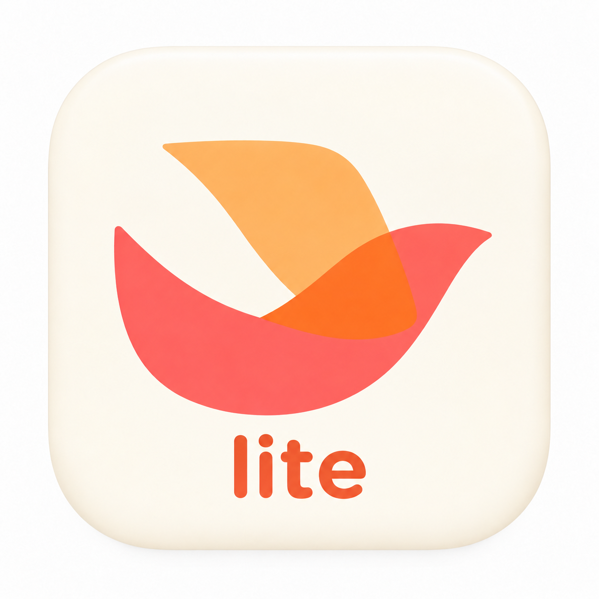

<p align="center">
  
</p>

<h1 align="center">FeishuChat</h1>

<p align="center">一个轻量的 macOS 飞书聊天客户端，专注收发消息。</p>

FeishuChat 让你不用打开飞书官方桌面客户端，也能查看单聊和群聊、回复消息、接收新消息提醒。用手机飞书扫码登录即可使用，不需要创建飞书开放平台应用或配置 API 密钥。

适合主要用飞书聊天、希望桌面上少一个庞大工作台的人。支持 **macOS 14 及以上版本**。

## 能做什么

- **日常聊天**：查看会话和历史消息，收发文本，向上翻阅更早的记录。
- **消息提醒**：实时接收消息，提供系统通知和 Dock 未读角标。
- **图片预览**：查看独立图片消息，点击放大、缩放；真实飞书图片下载仍待完整验证。
- **整理会话**：批量隐藏暂时不想看的聊天，随时从隐藏列表恢复。
- **留在后台**：关闭窗口后继续接收消息，也可以启用开机启动。

## 如何使用

目前需要从源码构建运行，尚未提供可直接安装的 App 或 DMG。

<details>
<summary>首次运行：准备环境并构建</summary>

需要完整的 Xcode（安装后打开一次，完成初始设置）和 Homebrew。在终端执行：

```bash
brew install uv xcodegen xcbeautify
git clone https://github.com/reorx/feishu-lite.git
cd feishu-lite

# 准备运行依赖
uv sync --project backend

# 让应用找到本机的 uv
printf 'FEISHU_UV_PATH = %s\n' "$(command -v uv)" > mac/Config/Local.xcconfig

# 构建并启动应用
cd mac
make build
make run
```

上面的配置命令适用于首次安装；已有 `mac/Config/Local.xcconfig` 时，请保留原内容，只更新其中的 `FEISHU_UV_PATH`。

应用会自动启动所需的后台服务，无须再开一个终端。以后可以在 `mac` 目录执行 `make run` 打开应用。当前运行方式依赖仓库目录，请保留它；如果移动了目录，需要重新构建。

</details>

1. 打开 FeishuChat，用**手机飞书扫描二维码**，在手机上确认登录。
2. 从左侧选择会话，查看消息；输入文字后按 **回车发送**，**Shift + 回车换行**。
3. 按提示允许系统通知。若之前拒绝过，可到「系统设置 → 通知 → FeishuChat」开启。
4. 想精简会话列表时，进入会话管理并选择要隐藏的聊天；需要时从「查看隐藏会话」恢复。
5. 如需开机启动，在应用菜单中勾选「开机启动」。

打开会话会同步标记为已读，手机端的未读也会随之清除。隐藏会话仅影响本机列表，不会退出群聊或关闭通知；收到新消息也不会自动取消隐藏。

## 使用范围

FeishuChat 是非官方客户端，目前专注基础聊天，不能替代飞书的完整工作台。暂不支持发送图片、文件传输、音视频会议和云文档协作；富文本内嵌图片、文件及卡片等内容可能只显示占位提示。

当前仅同步最近活跃的 100 个会话，不显示会话盒子及其中折叠的聊天。手机端已读状态同步到这里可能延迟几分钟。更多细节见[已知问题](kb/known-issues.md)。

登录凭证和消息缓存保存在本机。通过应用菜单「退出登录」会删除本机保存的凭证和消息缓存，下次使用需重新扫码。应用使用飞书网页版协议，飞书的更新可能影响可用性。

## Reference

- [cv-cat/LarkAgentX](https://github.com/cv-cat/LarkAgentX)：本项目使用其 `larkx` 包接入飞书网页版协议，实现扫码登录、消息收发等能力。
- [EthanQC/feishu-user-plugin](https://github.com/EthanQC/feishu-user-plugin)：早期调研中参考了它的登录凭证保活思路；本项目的扫码登录会话采用了不同的处理方式。
