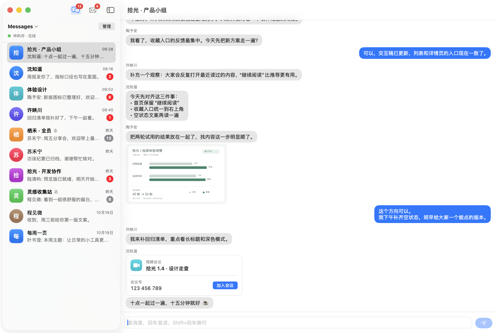
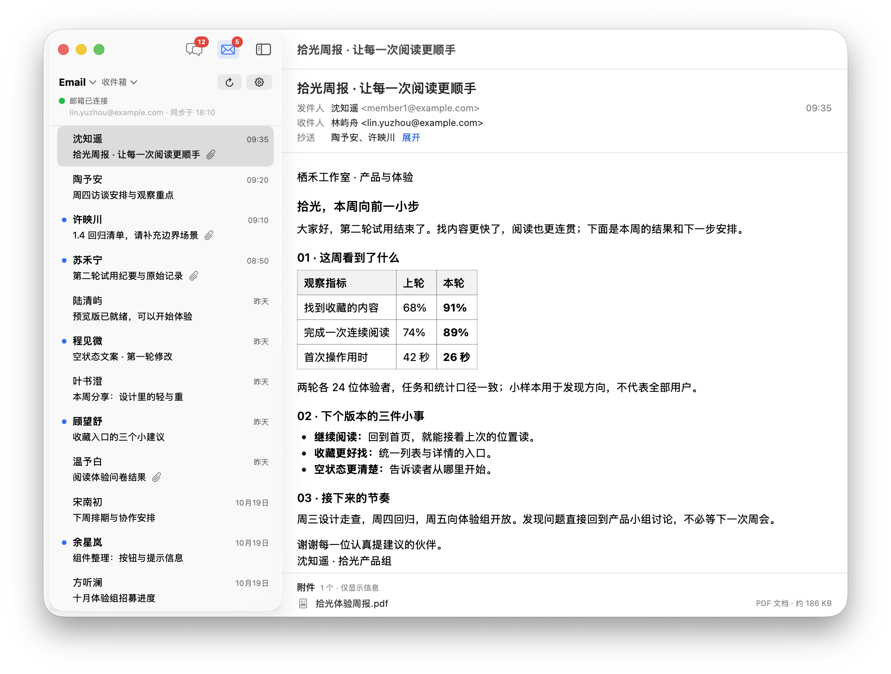

<p align="center">
  
</p>

<h1 align="center">FeishuLite</h1>

<p align="center">一个只用来聊天的轻量飞书 macOS 客户端</p>

飞书官方客户端里装着文档、日历、会议和工作台。如果你在电脑上用飞书主要是为了收发消息，可以试试 FeishuLite。用手机飞书扫码登录后，就能在电脑上查看会话、回复消息，有新消息时收到系统通知。

<table>
  <thead><tr><th>Messages</th><th>Email</th></tr></thead>
  <tbody><tr>
    <td><picture>
      <source media="(prefers-color-scheme: dark)" srcset="mac/Artwork/screenshots/messages-dark.png">
      
    </picture></td>
    <td><picture>
      <source media="(prefers-color-scheme: dark)" srcset="mac/Artwork/screenshots/email-dark.png">
      
    </picture></td>
  </tr></tbody>
</table>

截图中的人物、团队及内容均为虚构展示数据。

## 功能

- 查看单聊和群聊，往上翻可以看到更早的消息
- 发送文字消息
- 新消息实时到达，弹出系统通知，Dock 图标显示未读数
- 查看图片消息，点开可以放大
- 隐藏暂时不想看的会话，之后随时恢复
- 关掉窗口后仍在后台接收消息，可以设置开机启动
- Messages / Email 独立切换；邮箱支持配置、后台同步、收件箱分页、HTML/纯文本阅读、附件信息及邮件提醒，真实账号的接入与浏览已验收；真实新邮件提醒和睡眠恢复尚未在真实环境验证

## 安装

需要 **macOS 14 或更新版本**，支持 Apple Silicon 和 Intel。

直接运行：

```sh
brew install --cask reorx/tap/feishu-lite
```

Cask 自动安装 uv、Git、Python 3.12 和与 App 对应的后端。安装时需要联网访问 GitHub 和 Python 包源。升级前退出 App，再运行 `brew upgrade --cask feishu-lite`，完成后重新打开。卸载 Cask 会保留登录、消息、邮件数据及 uv 后端。

### 手动安装 DMG

从[本仓库 Releases](https://github.com/reorx/feishu-lite/releases) 下载 DMG，将 FeishuLite 拖到 Applications。发布包经过 Developer ID 签名和 Apple 公证。

**使用前必须安装 Python 后端 `feishu-lite-backend`**。App 本身不包含 Python 或 `larkx` 等依赖：

1. 安装 [Homebrew](https://brew.sh/zh-cn/)（已有则跳过），在终端运行 `brew install uv git`。
2. 复制对应 Release 页面提供的 `uv tool install --force --python 3.12 'git+https://github.com/reorx/feishu-lite.git@<版本对应的 commit>#subdirectory=backend'` 命令执行。请使用 Release 中的完整命令，不要原样输入占位符。
3. uv 会自动安装 Python 3.12、后端和固定版本的 `larkx`。安装需要联网访问 GitHub 和 Python 包源。

如果直接打开 App 而尚未安装后端，会显示安装说明和可复制命令。安装完点击「已安装，重新检测」即可。后端默认安装到 `~/.local/bin`，无需修改 Finder 的 PATH；升级 App 时也请执行新 Release 中的后端安装命令。

## 使用

1. 打开 FeishuLite，用手机飞书扫描窗口里的二维码，在手机上确认登录。
2. 在左侧选择一个会话。输入文字后按回车发送，按 Shift + 回车换行。
3. 系统询问是否允许通知时，选择允许。如果之前拒绝过，可以在「系统设置 → 通知 → FeishuLite」里打开。
4. 想让 FeishuLite 开机自动运行，在菜单栏的应用菜单里勾选「开机启动」。

在前台可见的 Messages 工作区打开一个会话会把它标为已读，手机上的未读也会一起清掉。停留在 Email 时，之前选中的聊天继续同步，但不会因为旧选择被自动标为已读；切回 Messages 后补判已读。

在侧栏顶部切换 Messages 和 Email，也可以按 ⌘1、⌘2；侧栏收起后用“显示”菜单或这两个快捷键切换。在 Email 里按 ⌘R 刷新收件箱。切换模块保留当前聊天与草稿，并记住当前模块供重启恢复。

Email 配置使用飞书邮箱地址及第三方客户端专用密码，与聊天扫码账号独立。支持邮箱功能的后端才显示配置；旧版本会提示重新安装后端。密码按邮箱账号存入 macOS 钥匙串，后端重启通过内存凭证恢复；写入失败会明确提示退出后需要重新输入，并提供重试。旧账号密码删除失败的清理记录跨 App 重启保留。Debug 与 Release 使用不同的钥匙串 service：Release 沿用旧名，Debug 缺失时需要重新输入，不迁移旧条目。实现契约见 [D1 报告](kb/sessions/2026-10-13-email-configuration-d1.md)。

Email 列出全部文件夹，首版仅读取收件箱。正文成功显示且 App 位于前台、窗口可见、当前处于 Email 时才提交已读；离线可读已缓存正文，失败不会清未读。HTML 禁止页面脚本与资源加载，合法 HTTP(S) 用户链接交外部浏览器；附件只显示信息。

邮件提醒按后端批次逐封或汇总，点击进入对应邮件或收件箱；睡眠唤醒后重连对账。成功投递记录防止确认失败时重复提醒。若 App 中断后无法确认投递结果，会保留待提醒邮件，Email 显示“再次提醒”入口，并说明可能重复显示；不会把未知结果当成功确认。各项验收证据汇总在 [收尾协调记录](kb/plans/2026-10-17-email-reader-finish-coordination.md)，尚未在真实环境验证的部分见 [known issues](kb/known-issues.md)。

目前还不能发送图片和文件，也没有音视频会议、云文档等功能，用到这些时请打开官方客户端。

FeishuLite 不是飞书官方产品，它使用和飞书网页版相同的方式连接飞书，飞书更新后可能会暂时无法使用。登录信息和消息缓存只保存在你自己的电脑上，不经过任何第三方服务器。

## Reference

- [cv-cat/LarkAgentX](https://github.com/cv-cat/LarkAgentX)：逆向实现的飞书网页版协议。FeishuLite 的扫码登录和消息收发都基于它的 larkx 库。
- [EthanQC/feishu-user-plugin](https://github.com/EthanQC/feishu-user-plugin)：FeishuLite 定时刷新登录状态的做法参考了它。
